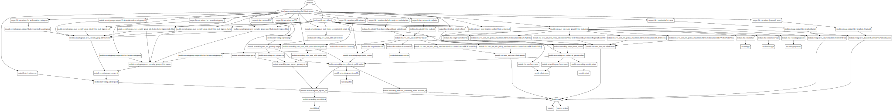

# tl-eks-terraform
Resources required for deployment of tl accounts on EKS using terraform IAC

**Requirement**
--------------------------
terraform v0.12, python-pydot, python-pydot-ng and graphviz for resource graph visualization

AWS provider version auto installed from terrafrom init and set to versoon "~2.0"

**Usage**
-----------------------------------

Use aws configure to load your api access keys to default  credentials file at "~/.aws/credentials"

Create 2 profiles dev and prod and use the same for aws credentials as well.

terraform variables will be defaulted to region=us-west-2 and profile=dev if not specified during the terraform plan

terraform validate

terraform init

terraform plan -out=tfplan

terraform apply tfplan

terraform destroy -auto-approve

**Resource graph**
--------------------------------
Resource graph of the terraform plan. Use graphviz to analyze it

sudo apt install -y python-pydot python-pydot-ng graphviz

terraform graph | dot -Tsvg > images/resource-graph.svg

**Output**
-----------------------------------------------------

Apply complete! Resources: 33 added, 0 changed, 0 destroyed.

The state of your infrastructure has been saved to the path
below. This state is required to modify and destroy your
infrastructure, so keep it safe. To inspect the complete state
use the `terraform show` command.

State path: terraform.tfstate

tl-dev-terraform-IGW = igw-031d081a7b416705c

tl-dev-terraform-dynamodb_name = tl-eks-dev-terraformstate

tl-dev-terraform-eks-clusterSecuritygroup = tf-tl-eks-cluster

tl-dev-terraform-eks-endpoint = https://B19BF0FE0520390101CA88F1981AE46C.gr7.us-west-2.eks.amazonaws.com

tl-dev-terraform-eks-kubeconfig-cert-authority-data = LS0tLS1CRUdJTiBDRVJUSUZJQ0FURS0tLS0tCk1JSUN5RENDQWJDZ0F3SUJBZ0lCQURBTkJna3Foa2lHOXcwQkFRc0ZBREFWTVJNd0VRWURWUVFERXdwcmRXSmwKY201bGRHVnpNQjRYRFRJd01EVXhPREEyTkRFek1sb1hEVE13TURVeE5qQTJOREV6TWxvd0ZURVRNQkVHQTFVRQpBeE1LYTNWaVpYSnVaWFJsY3pDQ0FTSXdEUVlKS29aSWh2Y05BUUVCQlFBRGdnRVBBRENDQVFvQ2dnRUJBT0R2CjlBT1I5V1Byb2NZb29iWjg4c0Q3dUFBOVZ2UkhrOGoxbmIrWFJSMjI5SXZ1eUdVUFE2SmJaN0pxQTRsc0QrMkcKVHJTeDBpTlBQcUxSeDdjYjRKSEtCZ2YrRkhGNUM2cXQzRWV4dGsrTHZScERrTGdHZktlOGVhc0ZEK2pKdXNTQgpuS0lOYlJkUmZJWUx1SnJhU3BLTjlocEpDbDJHR0RqSndiUGRSZkplVEh1TEwvQXZaNWJibW0vVDFLZUR0Z0lkCnRQQWNhN242OVI1NCtVcmJFVFMzTnMxYk5jYWcxc1NuNWFCZW8wY3R3UFRDOE5JUjI0RkdWV09DVFpGWWdoN1EKWVBldmoyWGNNVUxRZnRYWXRKVFppQ1g4dEE1MC85bEVCcFVVYmx4SVY4VVhjZTRtWUdISklSbHorUCtUZFpySgp2NU0zcXZldWUvQmZTRk1qcHJNQ0F3RUFBYU1qTUNFd0RnWURWUjBQQVFIL0JBUURBZ0trTUE4R0ExVWRFd0VCCi93UUZNQU1CQWY4d0RRWUpLb1pJaHZjTkFRRUxCUUFEZ2dFQkFHbEZFeXBFVXVjVkIyV0ludTNCUHdGT2VQbUQKTXFDQ2N2ZkMvSnB0MlhFWmJrcTlGYVRSS1dEOUpwOURjVWcrUVEwK0NrTUxzbDg0eHpQTi82dUN1UlY3SGMwZwo4QUJ2bWxsYUtvcklKV1Mwemg5cDFCazJqa09Sb284eTRBTjRsYjJKMkVid1lpS3pyb2VqalhDNlFJeDlWL1FuCnlPOVlUdWJ6b1VvWFZIMGVqMnBzcWN4dmdabHlmVFlndlJmMEttbC9YZ3dKQ3BYZ2R3aGUxMllBcVhKT0JLYVQKdURFNUoyeFFTcGIzV1EvK2xEQkZqQXc5bkJpclNBU25kUWxQWXhhQzc5NncyTHg5bVUrdE4zY2VLWTFoWWxJUwpqcVBEYk05TGtKdndTYWxzeWE1VUxnd3FXbVpqSTQzekJ6VjVRZXRPalZRVW1qUTh1SVhIR0hjZHF6Yz0KLS0tLS1FTkQgQ0VSVElGSUNBVEUtLS0tLQo=

tl-dev-terraform-eks-workernodesecuritygroup = tf-tl-eks-nodegroup

tl-dev-terraform-natGW = 52.34.227.104

tl-dev-terraform-privatesubnets = [
  "subnet-0d0ee7cf55ed1253d",
  "subnet-0e5f335c6d4a3b851",
]

tl-dev-terraform-publicsubnets = [
  "subnet-0dc6ef0e3d1a6d783",
  "subnet-0888f3492d5c91bef",
]

tl-dev-terraform-vpc = vpc-05ad72d1d7c3608ab

tl-dev-terraformbucket_name = arn:aws:s3:::tl-eks-dev-terraformstate

